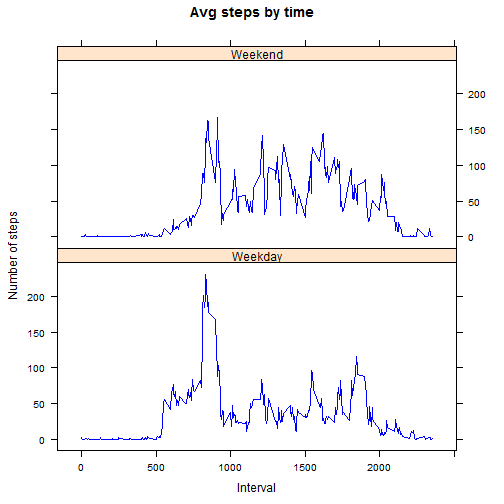

# Reproducible Research: Peer Assessment 1

This is the peer Assessment 1 for the coursera course "Reporduceable Research"
at [coursera](https://class.coursera.org/repdata-002). The detailed instructions are available
at the [Coursera Peer Assessment Page](https://class.coursera.org/repdata-002/human_grading/view/courses/972084/assessments/3/submissions).  
The Work is based on a fork from a provided [Github repository](http://github.com/rdpeng/RepData_PeerAssessment1). All nessesary data and template files are included in the Github repository.   
Please read the [README.md](README.md) file for further information.

## System Setup

```r
options(digits = 4, scipen = 4)
opts_chunk$set(echo = TRUE)
require("utils")
require("graphics")
require("grDevices")
require("lattice")
```

```
## Loading required package: lattice
```

```r
rm(list = ls())
# set timeformat to english on windows systems.
Sys.setlocale(category = "LC_TIME", locale = "english")
```


## Loading and preprocessing the data

Unzip and read the data into a dataframe.  
Add a new column with the data as date class.
Generate a Tidy dataset without NA values.


```r
Amd <- read.csv(file = unzip(zipfile = "activity.zip", files = c("activity.csv")), 
    header = TRUE, sep = ",", quote = "\"", dec = ".", na.strings = "NA", stringsAsFactors = TRUE)
colnames(Amd) <- c("steps", "datefactors", "interval")
Amd$steps <- as.numeric(Amd$steps)
Amd$date <- strptime(Amd$date, format = "%Y-%m-%d")
AmdTidy <- Amd[!is.na(Amd$steps), ]
```


## What is mean total number of steps taken per day?

Generate a historgram of the preaggregated data on day level.


```r
AmdbyDate <- aggregate.data.frame(x = AmdTidy[, "steps"], by = list(datefactors = AmdTidy$datefactors), 
    FUN = sum)
colnames(AmdbyDate)[2] <- "steps"

# https://class.coursera.org/repdata-002/forum/thread?thread_id=49
# discussion about hist or barplot - i started with barplot
hist(x = AmdbyDate$steps, col = "blue", xlab = "Steps", main = "Histogram of steps")
```

 


```r
MeanOfStepsPerDay <- round(mean(x = AmdbyDate$steps), 4)
MedianOfStepsPerDay <- round(median(x = AmdbyDate$steps), 4)
```


The **Mean** of the tidy(NAs removed) dataset is **10766.1887**.  
The **Median** of the tidy(NAs removed) dataset is **10765**.

## What is the average daily activity pattern?

Generate a time series plot the get a feeling for the daily activity.


```r
AmdbyInterval <- aggregate.data.frame(x = AmdTidy[, "steps"], by = list(interval = AmdTidy$interval), 
    FUN = mean)
colnames(AmdbyInterval)[2] <- "meansteps"

plot(x = AmdbyInterval$interval, y = AmdbyInterval$meansteps, type = "l", xlab = "interval", 
    ylab = "Avg steps", main = "Average steps by interval")
```

 

```r

MaxIntervalValue <- max(AmdbyInterval$meansteps)
MaxIntervalNumber <- AmdbyInterval[AmdbyInterval$meansteps == MaxIntervalValue, 
    "interval"]
```


The interval **835** with an average of **206.1698** was the hightest.

## Imputing missing values


```r
NumberOfNaValues <- sum(is.na(Amd$steps))
```


1.The total number of NA values in the steps (the only column with NA values) is **2304**.

2.Since there are always full days missing (NA) in the data it is useless to try to fill up
the NA values with averages of days - the days will be NA to. The only possibility is to fill the empty days with the mean of all days for the same interval.

3.A new dataset with the same structure and the NA values substitiuted is created.

```r
AmdFull <- (merge(x = Amd, y = AmdbyInterval, by = "interval"))
# For easier error checking sort the dataframe
AmdFull <- AmdFull[order(AmdFull$date, AmdFull$interval), ]
NAVector <- is.na(AmdFull$steps)
AmdFull[NAVector, "steps"] <- AmdFull[NAVector, "meansteps"]
AmdFull$meansteps <- NULL
```


4.A new histogram with a NAs substituted is generated again.


```r
AmdFullbyDate <- aggregate.data.frame(x = AmdFull[, "steps"], by = list(datefactors = AmdFull$datefactors), 
    FUN = sum)
colnames(AmdFullbyDate)[2] <- "steps"

hist(x = AmdFullbyDate$steps, col = "blue", xlab = "Steps", main = "Histogram of steps")
```

 

```r

MeanOfStepsPerDayFull <- round(mean(x = AmdFullbyDate$steps), 4)
MedianOfStepsPerDayFull <- round(median(x = AmdFullbyDate$steps), 4)
```


The **Mean** of the NA substituted dataset is **10766.1887**.  
The **Median** of the NA substituted dataset is **10766.1887**.

NB: In this case the effect to substitute the NA values with the mean of the same interval 
of all days has almost no effect. BUT this is just because of the special data constelation - the entire day is missing. If the NAs would be random distributed the effect would be probably much higher.

## Are there differences in activity patterns between weekdays and weekends?

We add a new factor variable to the dataset.


```r

AmdFull$Weekday <- weekdays(x = AmdFull$date, abbreviate = TRUE)
AmdFull[AmdFull$Weekday == "Sun" | AmdFull$Weekday == "Sat", "Weekday"] <- "Weekend"
AmdFull[AmdFull$Weekday != "Weekend", "Weekday"] <- "Weekday"
AmdFull$Weekday <- as.factor(AmdFull$Weekday)
```


We aggregate (mean) the data again by Weekday and interval and use this data
to create a plot by interval for Weekdays and Weekends.


```r
AmdPanelPlot <- aggregate.data.frame(x = AmdFull$steps, by = list(Weekday = AmdFull$Weekday, 
    interval = AmdFull$interval), FUN = mean)
colnames(AmdPanelPlot)[3] <- "steps"

xyplot(steps ~ interval | Weekday, data = AmdPanelPlot, type = "l", layout = c(1, 
    2), col = c("blue"), main = "Avg steps by time", xlab = "Interval", ylab = "Number of steps")
```

 


As you can see there is a noticable difference between the average steps on a weekday and on the weekend.
